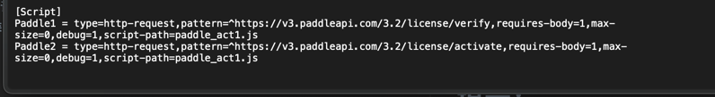

<!-- TOC -->

* [使用](#使用)
* [环境](#环境)
* [兼容](#兼容)
* [Surge](#surge)
* [提示](#提示)
* [警告](#警告)
* [目的](#目的)
* [交流](#交流)
* [~~停更~~](#停更)

<!-- TOC -->

# 使用

1. 终端进入本文件夹
2. 执行 sudo ruby main.rb 启动注入程序。
3. 要是你不差这几分钟时间，从头到尾先认真读一遍这个readme，可能你看完之后会解决你的部分疑惑。

# 环境

代码运行最低操作系统要求&此代码编译环境

- 最低运行 macOS High Sierra 10.13
- 编译SDK macOS 14.0
- 目标部署平台 macOS 10.13
- CMakeLists 环境变量
    - set(CMAKE_OSX_DEPLOYMENT_TARGET "10.13")
- 检查二进制文件的最低macOS版本兼容性
    - ```find . -name "*.*" | xargs otool -l | grep -E "(minos|sdk)"```

# 兼容

| App                                            | 版本                                                                                                  | ARM64 | Intel | 特殊要求                            |
|:-----------------------------------------------|:----------------------------------------------------------------------------------------------------|:-----:|:-----:|:--------------------------------|
| iShot                                          | 2.3.8                                                                                               |   ✅   |   ✅   |                                 | 
| Infuse Pro                                     | 通杀                                                                                                  |   ✅   |   ✅   |                                 | 
| Parallels Desktop                              | [18.3.2](https://download.parallels.com/desktop/v18/18.3.2-53621/ParallelsDesktop-18.3.2-53621.dmg) |   ✅   |   ✅   |                                 | 
| Surge 5                                        | 通杀已经被内鬼举办了，RIP。                                                                                     |   ❌   |   ❌   | 年度好戏我愿称之为 《窃听风云8:赛博卧底》          | 
| CleanMyMac X                                   | 4.14.1                                                                                              |   ✅   |   ✅   | 不要下大陆特供版                        | 
| MWEB Pro                                       | 通杀                                                                                                  |   ✅   |   ✅   |                                 | 
| App Cleaner & Uninstaller                      | 8.2.1                                                                                               |   ✅   |   ✅   |                                 | 
| 解优2                                            | 1.6.1~通杀                                                                                            |   ✅   |   ✅   |                                 | 
| Omi录屏专家                                        | 1.3.1~通杀                                                                                            |   ✅   |   ✅   | 需要从Mac AppStore 下载              | 
| OmniPlayer                                     | 2.1.0~通杀                                                                                            |   ✅   |   ✅   | 需要从Mac AppStore 下载              |
| Navicat Premium                                | 16.1.10～通杀                                                                                          |   ✅   |   ✅   | 需要从Mac AppStore 下载              |
| Navicat 16 ForOracle                           | 16.2.4～通杀                                                                                           |   ❌   |   ✅   | 需要从Mac AppStore 下载 我下不到ARM64的版本 |
| Microsoft Office Word/PowerPoint/Excel/Outlook | 16.75.2 365订阅版                                                                                      |   ✅   |   ✅   | 需要从Mac AppStore 下载              |
| Affinity Photo 2/Designer 2/Publisher 2 全家桶    | 2.1.1                                                                                               |   ✅   |   ✅   | 需要从Mac AppStore 下载              |
| ProxyMan                                       | 4.9.0                                                                                               |   ✅   |   ✅   |                                 |

| Adobe 全家桶               | 版本                                  | ARM64 | Intel | 特殊说明                                                    |
|:------------------------|:------------------------------------|:-----:|:-----:|:--------------------------------------------------------|
| Adobe PhotoShop         | 24.7.0                              |   ❌   |   ✅   | ARM党别私我了 我Intel机器下不到ARM版本 要么你就提供文件 要么就别废话 PS:神经滤镜已经完美可用 |
| Adobe PhotoShop Beta    | 25.0.0 20230727.m.2257 47ac892  x64 |   ❌   |   ✅   | 支持创意填充/神经滤镜 需要随便登录个账户                                   |
| Adobe Acrobat           | 23.003.20244                        |   ✅   |   ✅   |                                                         |
| Adobe Illustrator       | 27.6.1                              |   ✅   |   ✅   |                                                         |
| Adobe Lightroom Classic | 12.4                                |   ❌   |   ❌   | 功能不可用 等后续更新                                             |
| Adobe Premiere Pro      | 23.5                                |   ❔   |   ❔   | M1/x86版本灰度测试 测试报告有效/无效 我没有安装                            |

# Surge

Surge 更新地址: https://www.nssurge.com/mac/v5/appcast-signed-beta.xml <br>
Surge 最新版地址: https://dl.nssurge.com/mac/v5/Surge-5.2.1-2303-92c83c5d58a046eae6c06c3e82b77afb.zip <br>
Surge开启MitM和脚本功能，然后:

1. 在你的配置文件中加入例子中提供文件中的Script字段信息:
   [Surge脚本配置例子.conf](Surge%E6%BF%80%E6%B4%BB%E8%84%9A%E6%9C%AC%2FSurge%E8%84%9A%E6%9C%AC%E9%85%8D%E7%BD%AE%E4%BE%8B%E5%AD%90.conf)
   
   
   

2. [paddle_act.js](Surge%E6%BF%80%E6%B4%BB%E8%84%9A%E6%9C%AC%2Fpaddle_act.js)这个文件一定要复制到conf文件所在目录中。

3. 记得Https解密打开，并且信任证书，MitM域名加入*.paddleapi.com保存即可。
   

4. 在App中随意输入序列号和邮箱，点击激活后秒激活。

已测试支持以下App:

| App         | 版本    | 特殊说明 |
|:------------|:------|:-----|
| AlDente Pro | 1.22  |      |
| AirBuddy    | 2.6.3 |      |

# 提示

1. 会自动扫描本地安装的App，你只需要在想注入的App后面输入y即可。
2. Adobe App如果不想让官方ACC乱拉屎，可以用这个仓库下载v6版本的离线安装包: https://github.com/Drovosek01/adobe-packager,
   然后配合AntiCC之类的组件运行Adobe产品。
3. 激活之后由于App还需要依赖我的注入代码，所以不要移动注入文件夹或者删除注入文件夹，有的人用完就把注入文件夹删了，第二天就到处说破解不稳定第二次就崩溃。
   这种人你动动你那个🐷脑子想想为什么第一次能用删了我的注入文件夹第二次打开就崩溃？

# 警告

一定要关闭SIP，因为我使用的注入方式依赖于关闭SIP。

# 目的

本项目是Free的、开源的、基于互联网最原始的共享精神的、不接受任何打赏的、无所不包的、令人感叹的、无与伦比的、精妙绝伦的、化腐朽为神奇的、逆天的、养生的、抽象的、二次元的、OP的。

在2023年，所有人都逐渐觉得打赏、付费才是理所应当的，哪怕是某些人只做了一件从外网搬运到国内的工作，也应该得到鼓励。
我不能说这种行为是完全错误的，只能说有些人恬不知耻见利忘义。哪怕是打赏也应该基于双方意愿的基础上，而不是用“打赏后才能下载”这种理由强奸用户的使用习惯，把用户变成必须付费的蠢驴，并辅以几十元的超低价注册会员费用钝刀割肉式的强奸用户。

当然，这种用户也确实是个蠢货。有这种钱你买正版得了，别跟我说太贵，你出去跟朋友吃一顿好点的饭200起步，大部分好软件正版才不到100块钱。抽包烟软中煊赫门起步，面对19.9年费会员时却面露难色，好像杀了你的🐎一样。相信我，你也并不是真的需要这些软件，只是人云亦云盲目从众罢了。

我认为，共享精神不应该建立在物质上，我深刻的理解金钱对人的吸引和动力，但这种精神本身就超越了物质。

# 交流

别让欲望击穿你の意志

QQGroup: 718372160

下方小作文阅前预警:

- 大家都知道楼主一向是有话直说 比较单纯
- 喷人解决不了问题 但是能解决一部分人潜在会提出的问题
- 但是请大家放心，楼主素质是很高的 爱恨分明。
- 玻璃心的人现在立刻关闭当前网页，继续阅读我怕你被我喷的到处散布谣言说我坏话败我路人缘。
- 有些人不专门写小作文喷一下真的就是为所欲为，本来不想搭理但是有的人真的该喷。

本群欢迎以下人群进入:

- 愿意学习交流安全共享知识技术的人 不区分大佬和新手 一律欢迎
- 不抄ChatGPT答案的人
    - 他妈的ChatGPT给的答案都是0x1000为例子 有的人猪脑子直接复制答案 完全看不到gpt说了是“例如” 还他妈把0xFFFC这种答案复制粘贴
      你这种人确实没脑子 别进了
    - 真想进就认真答题 错了也会放 我最鄙视的就是没脑子抄答案的人

本群禁止以下人群进入:

- 因为“7.11”停更事件被动引流而来的围观群众
- 进来只为发一句“慕名而来”的人
- 加群原因写一句“不知道”/“从xxx地方看到的”/“进来看18岁妹妹后续”这种傻逼

符合以上条件的人先掂量一下你的🐎有几个。<br>
有些傻逼进来就为发一句“慕名而来”或者发一张截图，配文“从xxx地方看到的”，极其影响老子心情。<br>
本来18岁妹妹g了老子心情就很不好，反复在老子眼前刷要不是老子素质高早他妈喷你了，你是个什么东西要你在这“慕名而来”？<br>
你给老子上眼药老子还不能喷你的？在我看不见的地方刷刷算了，别tm来老子群里刷。<br>

之前还看到有人说老子利用这件事给这个群引流的那些傻逼你听好：<br>

* 首先为接下来的话我给你先道个歉。<br>
* 我引你妈了个b流呢？老子跟18岁妹妹郎才女貌要你在这围观评价？你是个什么臭鱼烂虾？引流？老子谈恋爱跟你有几把关系？傻逼。<br>
*

祝福我的人我虚心感谢，嘲笑我的人先照镜子看看自己单身二十多年天天躲房间里看日本黄片到处求二次元h漫N刷天天做梦自己能碰到女神小姐姐主动倒贴实际上除了同学朋友也很少月薪三千最后没办法找个190kg坦克还要忍受小仙女作妖27、8岁除了会躲房间里打胶其他什么都不会一事无成的失败人生，你这种废物也好意思评价我？我要是你早他妈从长江大桥上跳下去remake别在这浪费父母资源当个真孝子。

* 你没有脑子不要觉得所有人都没脑子，群里全是(大部分，小部分确实不行)
  安全行业的兴趣爱好者或者安全行业的专家,我需要一窍不通的围观群众拉低我群含金量？<br>
* 我不需要没脑子的人加进群，ok？这种劣质流量等于垃圾，在我眼里这种人一点价值都没有，除了挨喷没有任何作用。
* 最后声明: 我热烈欢迎安全爱好者一起学习研究，但是没脑子的围观党禁止加群。这种人你非要加群可以，我没事就喷你。看是你的赛博🐎多还是我的键盘厉害。

# ~~停更~~

~~最近想追个19岁的小妹妹。<br>
项目基本上不会更新了，增加的新项目基本上是工作💻需要才做的。<br>
也不会去维护下面App的新版本了，等我追到手🧑‍🤝‍🧑再说罢！<br>~~

~~为了追💗妹妹👧，MD，跟米哈游原神铁道星穹崩坏王者荣耀蛋仔二次元拼了😡👊！<br>
这下不得不成为农P/原P/穹P了🙏🙏<br>~~

~~无知时诋毁原神🫤🙏<br>
成熟时理解原神😭🙏<br>
恋爱时成为原神😋🙏<br>~~

~~原神助我！喝唉！🖐大荒天陨！️<br>
任何邪恶！终将绳之以法👮！<br>~~

~~原神，启动！~~

失败了，大家别问了。 <br>
她不是不喜欢玩游戏，她只是不想和不喜欢的人玩游戏。<br/>

这段Repo不会删，警钟长鸣。但是你要问我如果再给我一次机会还会不会选18岁妹妹，我的回答是“yes i do.”